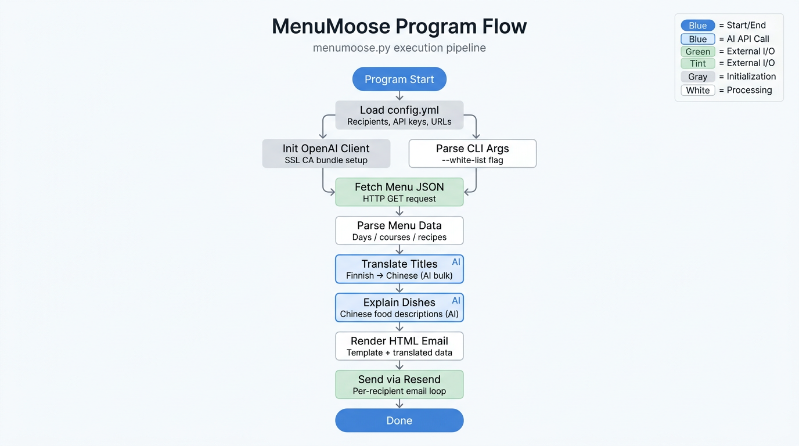

# MenuMoose

自动获取 Nokia Linnanmaa Oulu 每周菜单，使用 AI 将菜名翻译为中文，并发送 HTML 风格邮件给订阅用户。

MenuMoose fetches Sodexo weekly menu data, translates dish names to Chinese, and sends styled HTML email updates.

---

## 流程图



---

## 功能特性

- 每周自动运行（GitHub Actions）
- 菜名双语显示（英文 + 中文）
- 每个 Course 自动拆分多道菜（按 / 分割）
- 使用芬兰语原始菜名作为翻译输入，提高中文准确性
- AI 菜品解说：每道菜配中文口味、食材、酱料风格描述，帮助不熟悉西餐的读者判断是否合口
- HTML 邮件模板渲染（来自独立模板文件）
- 收件人隐私保护（不在邮件头暴露列表）
- 邮件内置退订链接（mailto: 一键退订）
- `--white-list` 测试模式：仅发送给 `recipients_test` 列表，用于调试
- 使用 Aliyun DashScope（qwen3.6-plus）进行批量翻译与菜品解说
- 通过 Resend API 发送 HTML 邮件
- 企业网络兼容（系统 CA bundle，适配 Zscaler）

---

## 项目结构

MenuMoose/
- .github/workflows/menumoose.yml
- assets/menumoose-flowchart.png
- config.yml
- menumoose.py
- email_render.html
- render_preview.py
- preview_rendered.html
- example.json
- requirements.txt
- README.md

说明：
- email_render.html: 邮件 HTML 模板（含占位符）
- render_preview.py: 本地注入虚拟数据并生成预览
- preview_rendered.html: 本地预览输出文件
- assets/menumoose-flowchart.png: 程序流程图

---

## 配置说明

### 1. config.yml（非敏感配置，纳入版本管理）

- `recipients`: 正式收件人列表
- `recipients_test`: 测试收件人列表（配合 `--white-list` 使用）
- `menu_url`: Sodexo 周菜单 JSON 地址
- `translation.model` / `translation.aliyun_api_base`: 翻译模型与 API Base URL
- `resend_from_email`: Resend 发件地址（From，含显示名）
- `restaurant`、`mystery_box`: 邮件展示信息

示例：

```yaml
recipients:
  - your.name@example.com

recipients_test:
  - dev@example.com

menu_url: "https://www.sodexo.fi/ruokalistat/output/weekly_json/3207223"

translation:
  model: "qwen3.6-plus"
  aliyun_api_base: "https://dashscope.aliyuncs.com/compatible-mode/v1"

resend_from_email: "MenuMoose <noreply@panda-tech.top>"
```

### 2. GitHub Secrets（敏感信息）

在仓库 Settings → Secrets and variables → Actions 中配置：

| Secret | 说明 |
|---|---|
| `ALIYUN_API_KEY` | Aliyun DashScope API Key（翻译） |
| `RESEND_API_KEY` | Resend API Key（邮件发送） |

说明：当前代码不再使用 SMTP 账号密码发送邮件。

---

## GitHub Actions 工作流

文件位置：[.github/workflows/menumoose.yml](.github/workflows/menumoose.yml)

- 定时：每周一 UTC 04:00（赫尔辛基约 07:00，夏令时）
- 支持：手动触发（workflow_dispatch）

流程：

1. 拉取 Sodexo JSON 菜单
2. 提取每天 Course 1/2，按 `/` 拆分为独立菜品列表
3. 批量翻译全周所有菜名（芬兰语 → 中文，1 次 API 调用）
4. 生成每道菜的中文解说（口味、食材、酱料描述，1 次 API 调用）
5. 渲染 HTML 邮件正文（模板：`email_render.html`）
6. 通过 Resend API 逐个发送给收件人（含退订链接）

---

## 邮件格式示例

```
┏━━━━━━━━━━━━━━━━━━━━━━━━━━━━━━━━━━━━━━━━━━━━━━━━━━┓
   NOKIA LINNANMAA OULU  |  Weekly Menu 每周菜单
   23.3. — 29.3.
┗━━━━━━━━━━━━━━━━━━━━━━━━━━━━━━━━━━━━━━━━━━━━━━━━━━┛

饮食标签 | DIET LABELS
G: Gluten free 无麸质  L: Lactose free 无乳糖  M: Milk-free 无奶制品  VL: Low lactose 低乳糖

📅 MONDAY 周一
🌟 Favourites                            8,80€
Pork stew with honey & beet root (G,L)
蜂蜜甜菜根炖猪肉
Spicy lentil stew (G,M)
辣扁豆炖菜
🛒 Food Market                           11,80€
Pan patty with cream sauce (G,L)
香煎肉饼配奶油酱
Vegetable patties with herb yogurt (G,L)
蔬菜饼配香草酸奶
```

---

## 本地运行

### 安装依赖

```bash
python -m venv venv && source venv/bin/activate
pip install -r requirements.txt
```

### 设置环境变量

```bash
export ALIYUN_API_KEY="your-aliyun-api-key"
export RESEND_API_KEY="your-resend-api-key"
```

### 运行

```bash
# 正式发送（全部收件人）
python menumoose.py

# 测试模式（仅发送给 recipients_test）
python menumoose.py --white-list
```

运行时会打印各步骤进度，便于定位超时或连接问题：

```
[1/5] Fetching menu...
  [fetch_menu] GET https://...
  [fetch_menu] HTTP 200, 90779 bytes
[2/5] Menu fetched: 23.3. - 29.3., 5 days
[3/5] Translating menu...
  [translate] Calling https://dashscope.aliyuncs.com/compatible-mode/v1 model=qwen3.6-plus, 10 titles...
  [translate] API response received (407 chars)
[4/5] Translation done. Generating dish explanations...
  [explain] Calling https://dashscope.aliyuncs.com/compatible-mode/v1 model=qwen3.6-plus, 10 course entries...
  [explain] API response received (1203 chars)
[5/5] Dish explanations done. Sending email...
  [resend] Sending to 1 recipient(s)...
Done. Email sent successfully.
```

---

## 企业网络 / Zscaler 兼容

本地开发环境若通过 Zscaler 等 MITM 代理上网，代码会自动使用系统 CA bundle（而非 `certifi` 内置 CA）来完成 SSL 验证：

- **翻译 API**：`_make_openai_client()` 使用 `ssl.get_default_verify_paths()` 获取系统 CA 路径，注入 `httpx.Client`

GitHub Actions 环境无代理限制，相同代码直接可用。

---

## 常见问题排查

### 翻译失败 / Connection error

- 确认 `ALIYUN_API_KEY` 已配置且有效
- 企业网络下用 `curl -X POST https://dashscope.aliyuncs.com/compatible-mode/v1/chat/completions ...` 验证网络可达性
- 检查是否有代理环境变量：`echo $HTTPS_PROXY`

### 收不到邮件 / Resend 发送失败

- 确认 `RESEND_API_KEY` 已配置且有效
- 确认 `resend_from_email` 已在 Resend 完成域名/发件地址验证
- 查看运行日志中的 `[resend]` 输出与返回的邮件 ID

### 菜单为空或缺失

- 检查 `menu_url` 是否有效
- Sodexo 接口结构变化时需更新 `fetch_menu()` 解析逻辑

---

## 主要函数

- `fetch_menu()`: 拉取并解析每周菜单，提取英/芬菜名及 recipe 组成
- `translate_menu_bulk()`: 去重、查缓存、调用 OpenAI API 批量翻译
- `translate_days()`: 以芬兰语为输入，批量翻译并映射到中文
- `explain_days()`: 以芬兰语菜名 + recipe 名为输入，生成中文菜品解说
- `format_menu_html()`: 读取 `email_render.html` 并渲染动态内容
- `send_menu_email()`: 通过 Resend API 逐个发送 HTML 邮件（含退订链接）
- `_unsubscribe_url()`: 生成 mailto: 退订链接
---

## 更新日志

### 2026-04-16
- 新增 `explain_days()`：每道菜自动生成中文解说（口味、食材、酱料风格），帮助不熟悉西餐的读者判断是否合口
- 新增 `--white-list` CLI 参数：测试模式仅发送给 `recipients_test`，避免误发正式收件人
- 新增 `_unsubscribe_url()`：每封邮件底部嵌入 mailto: 退订链接
- `config.yml` 新增 `recipients_test` 测试收件人列表
- 翻译模型升级为 `qwen3.6-plus`
- 流程步骤从 4 步扩展为 5 步（新增菜品解说步骤）
- 新增程序流程图（`assets/menumoose-flowchart.png`）
- README 全面对齐当前实现

### 2026-04-06
- 修复菜单拆分逻辑：避免将 `w/...` 中的斜杠当作菜品分隔符（如 `w/smetana` 不再被误拆）
- 使用正向后向断言 `(?<!\bw)/` 替代简单 `.split('/')`，确保仅真实分隔符被拆分
- 解决由菜单拆分错误导致的英-中菜品映射错位和翻译失败指标错误
- 邮件发送每个收件人间添加 1 秒延迟，规避 Resend API 速率限制（5 req/s）

### 2026-04-03
- 邮件发送通道从 SMTP 切换为 Resend API（`send_menu_email()` 改为通过 `resend` 逐个收件人发送）
- 新增 `RESEND_API_KEY` 环境变量校验，缺失时直接报错，避免静默发送失败
- `config.yml` 新增 `resend_from_email` 发件地址配置，并补充 `resend` 依赖
- GitHub Actions 工作流同步调整：安装 `resend`，并显式注入 `ALIYUN_API_KEY`（修复 CI 中翻译未初始化问题）
- `fetch_menu()` 新增 recipes 名称提取字段（`c1_recipes` / `c2_recipes`）以便后续扩展展示

### 2026-04-01
- 邮件发送切换为 HTML only
- README 对齐当前实现
- 文档补充模板预览流程与占位符说明

### 2026-03-31
- HTML 模板抽离为独立文件 email_render.html
- 新增 render_preview.py 本地虚拟渲染

### 2026-03-30
- 支持 Outlook 兼容样式调整
- 支持模板内 Powered by 链接与 footer 布局调整

### 2026-03-29
- 菜单改为每道菜独立显示
- 翻译输入改为芬兰语原文

### v1.2.0 (2026-03-29)
- 菜单排版重构：每道菜独立 `• 英文 / 中文` 两行展示，替代原单行合并格式
- `fetch_menu()` 新增按 `/` 拆分同课程多菜品逻辑
- 日期标题格式更新：`MONDAY · 周一`

### v1.1.1 (2026-03-28)
- SMTP 端口改为 465（SMTPS），修复 Zscaler 环境下 587 STARTTLS 握手超时
- `_make_openai_client()` 新增系统 CA bundle 注入，修复企业代理 SSL 验证失败
- 全流程新增 `print(..., flush=True)` 调试输出，便于定位超时步骤

### v1.1.0 (2026-03-26)
- 配置迁移：非敏感配置统一放入 `config.yml`
- 邮件隐私优化：收件人地址不在邮件头中暴露
- 翻译稳定性优化：增强模型输出清洗与部分成功兜底

### v1.0.0
- 初始版本发布

